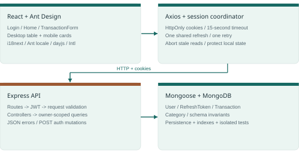
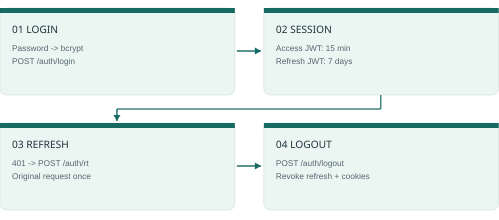

# Daily Ledger - Implementation & interview report

Technical assessment · evidence, architecture, decisions and final review

> A working, authenticated income and expense diary with a documented delivery boundary.

**2026-10-08 · Code snapshot: 72817a2**

## 1. Delivery overview

A functional assessment MVP, with subsequent usability and localization enhancements.

Daily Ledger implements persistent, user-owned income and expense transactions. It retains the supplied React / Node.js / Ant Design stack and uses Express, MongoDB and Mongoose for a small, explicit API. The initial transaction placeholder and mock authentication were replaced with working flows.

| Delivered | Evidence |
| --- | --- |
| Core product | Create, list, read, edit and delete; amount, category, calendar date and description. |
| User experience | Desktop table, mobile cards, shared form, feedback states, demo autofill, totals, search and sorting. |
| Data and access | Integer cents, calendar validation, server-side ownership, real bcrypt/JWT authentication, reusable categories. |
| Final verification | 69 API tests + 7 session tests; lint, formatting and production build pass. |
| Languages | English and Italian in the app; this English report and a separate Ukrainian preparation guide. |

> **Delivery boundary**
>
> The product is a local assessment implementation. Docker Engine remains unavailable on this machine; production deployment, password recovery, GitHub publication, Loom upload and submission are not completed.

This report is based on the assessment PDF, the initial commit 44dae2e, the delivered code and recorded checks on 2026-10-08. It explains both implementation choices and their limits. The implementation and review were AI-assisted; authorship and assistance should be described accurately in an interview.

Reading route: sections 2-8 explain the product; 9-12 cover final review, evidence and limits; 13-15 support the technical interview and handoff.

## 2. Requirements and starting point

Core requirements are distinguished from later enhancements.

| Assessment requirement | Implementation / status |
| --- | --- |
| React, Node.js, Ant Design | Retained. React 18.3.1; Ant Design 5.18.2; Express 4.22.3; Vite 8.3.3. |
| Full transaction CRUD | POST/GET/PATCH/DELETE endpoints and the shared create/edit modal. |
| Amount, category, date, description | Validated fields; description optional; USD chosen for the MVP. |
| List or table | Desktop table; equivalent cards below 768 px. |
| Responsive interface | Responsive form, mobile cards, compact account/language controls. |
| At least one API test | 69 database-backed HTTP integration tests in Api/specs. |
| Filtering or sorting (bonus) | Both implemented client-side, plus income/expense/balance totals. |
| Repository, 3-5 minute Loom, submission | Local commit history, clean export and Loom script prepared; external delivery remains pending. |

### What the template actually supplied

The Api/FrontEnd split, React/Ant Design/Express scaffolding, Mongoose-related utilities, routing, Axios/AuthContext concepts, i18next EN/IT common/core dictionaries and Jest scaffolding were present. Home only displayed an assessment placeholder. Transaction routes, models and forms were absent.

Login and JWT handling used mock behavior; the original forgot-password UI did not have a complete working recovery service. The final screens were authored from Ant Design primitives. Old table/sidebar/admin/company modules remain inactive and are excluded from the clean export.

MongoDB, authentication hardening, custom categories, localization, totals and USD were implementation choices or later user requests, not additional requirements asserted by the PDF. i18next existed in the original scaffold and was reintegrated into the rebuilt UI.

Source: Technical_Assessment_Somnia(Web).pdf, pp. 1-4; baseline 44dae2e. The PDF requests a short timebox, with a two-hour submission condition unless otherwise agreed. No audited time log proves a two-hour completion; subsequent UX work expanded the scope.

## 3. System architecture

Four responsibilities are separated without adding a large application framework.



| Boundary | Responsibility and reason |
| --- | --- |
| React screens | Own presentation, filters, pagination and modal state. One form serves create and edit to avoid divergent validation. |
| Axios / session module | Transport cookies, coordinate refresh/logout, retry once and expose failures. Session concurrency is testable independently of React. |
| Express | Explicit routes, authentication, request validation, controllers and one JSON error boundary. Only reviewed routes are mounted. |
| Mongoose / MongoDB | Schema invariants, owner predicates, indexes and durable storage. A real isolated MongoDB is used in integration tests. |

A create request follows: form validation -> decimal-to-cents conversion -> POST /transactions -> JWT/user verification -> request allowlist and business validation -> category registration -> transaction insert -> response -> UI state update. A failed request leaves the form available with feedback.

app.js exports the Express app for tests. index.js handles process startup and awaits the database before opening port 4000. The frontend runs on 3000. MongoDB runs on localhost:27017 in Docker or the documented local fallback.

Main references: FrontEnd/src/routes/Home.jsx; components/TransactionForm.jsx; helpers/core/session.mjs; Api/app.js; controllers/transactions.js; db/connect.js.

## 4. Data model and invariants

Business dates and money have explicit representations.

| Transaction field | Stored representation / rule |
| --- | --- |
| user | Required User ObjectId from the verified session; excluded from transaction responses. |
| type | income or expense. |
| amountCents | Positive safe integer, 1-999,999,999; maximum USD 9,999,999.99. |
| category | Canonical preset or normalized custom name; at most 64 characters. |
| date | Valid Gregorian calendar string YYYY-MM-DD, years 1900-9999. |
| description | Optional trimmed text, at most 500 characters; defaults to empty string. |
| createdAt / updatedAt | Mongoose lifecycle timestamps; distinct from the chosen business date. |

### Case: money that remains exact

Input 12,34 is normalized to 12.34. The decimal string is split into whole units and fractional digits, producing 1234 cents. The API and schema reject fractional cents, zero, negatives and values beyond the bound. Input 12.345 fails validation; it is not silently rounded. Letters are rejected during typing or insertion.

### Case: a calendar day that does not shift

2024-02-29 remains that date in different timezones because it is not parsed as a UTC midnight timestamp. Gregorian leap-year checks reject 2023-02-29 and 2026-04-31. Future dates are currently accepted; no planned/completed distinction is modeled.

Date sorting compares date, then createdAt, then _id. Two same-day entries therefore have stable ordering, and editing a description does not make an older entry newest. The tooltip displays only the local creation clock time, HH:mm:ss. It does not establish when the real-world transaction occurred.

Other collections: User (email and bcrypt hash); RefreshToken (user, hash and expiry); Category (user, type, name). Indexes: Transaction(user,date,createdAt); unique Category(user,type,name); refresh expiry TTL. The _id sort tie-breaker is not included in the transaction compound index.

## 5. Authentication and session lifecycle

Identity is verified on the server, and cookies carry the session.



- User passwords are hashed with bcrypt cost 10. Login verifies the stored hash and returns a generic incorrect-credentials response. Login is limited to 20 attempts per minute per IP outside tests.
- Access JWTs expire after 15 minutes; refresh JWTs after 7 days. Separate required secrets, HS256 verification, token purpose and ObjectId subject checks prevent accepting the wrong token kind.
- Cookies are HttpOnly and SameSite=Lax; Secure is enabled in production. Axios sends credentials. Local authentication requires using 127.0.0.1 consistently for browser, API and CORS origin.
- Refresh persistence stores a SHA-256 hash of the token with its user and expiry. The refresh query checks expiry explicitly; correctness does not depend on immediate TTL cleanup.
- Concurrent 401 responses share one in-flight refresh. Each original request retries at most once. A business error after successful refresh is shown without incorrectly ending the session.
- Logout waits for a pending refresh, then revokes its persisted session and clears cookies. Session-version checks prevent stale callbacks from restoring the signed-out UI.

> **What this does not guarantee**
>
> A copied access JWT remains valid until its 15-minute expiry. Refresh tokens are not rotated. There is no cross-tab session synchronization, registration, email verification, password recovery, MFA or session-management screen.

POST refresh/logout follows HTTP mutation semantics [E1]. SameSite and CORS are useful controls, but this report does not claim a comprehensive CSRF/XSS audit. Production HTTPS, trusted origins and operational security require deployment work.

## 6. API contract and ownership

The authenticated user is part of every transaction query.

| Method / path | Behavior |
| --- | --- |
| POST /auth/login | Verify credentials; public user profile and session cookies. |
| GET /auth/check | Current public profile, or 401. |
| POST /auth/rt | Verify persisted refresh session and issue access cookie. |
| POST /auth/logout | Revoke refresh session and clear cookies. |
| GET /transactions | List current user's records, sorted by date / creation / ID. |
| POST /transactions | Create owned record; 201 with stored representation. |
| GET /transactions/:id | Read one owned record. |
| PATCH /transactions/:id | Validate supplied fields; return updated record. |
| DELETE /transactions/:id | Delete one owned record; 200 acknowledgement. |
| GET /categories | Preset and current-user custom categories grouped by type. |

The request body is an explicit allowlist. Owner injection, unknown fields, MongoDB operators, wrong types and empty PATCH bodies are rejected. A caller cannot set user. Read/update/delete combine the ID with req.user.id; foreign and nonexistent records both return 404.

| Status | Meaning |
| --- | --- |
| 400 / 401 / 404 | Invalid request / unauthenticated session / absent or foreign resource. |
| 409 | Classification changed after the server read and before its atomic update. |
| 413 / 429 / 500 | JSON body beyond 16 KB / login throttling / generic server error. |

```
Example: POST /transactions
{"type":"expense","amountCents":1234,"category":"Food & drinks",
 "date":"2026-10-08","description":"Lunch"}
```

Error shape: {"error":400,"message":"...","data":{"field":"..."}}. Field is optional; error may be an application-specific code. Malformed JSON returns a fixed message without echoing input fragments. API/models/transaction.js controls public serialization.

## 7. Category rules and concrete cases

Category and transaction type form one business constraint.

| Case | Behavior | Why it works |
| --- | --- | --- |
| Transport expense -> Income | Clear incompatible selection and show an explanation. | UI checks destination catalog; API independently validates the pair. |
| Other + blank optional name | Save the shared preset Other. | The optional name is omitted; no artificial custom entry is created. |
| Other + '  pEt   CARE ' | Save Pet Care and make it reusable. | NFKC, trim, whitespace collapse and Title Case run on the server. |
| Repeated Pet Care | Reuse one category per user/type. | Unique compound index plus duplicate-key recovery protects concurrent upserts. |
| Delete last Pet Care record | Pet Care remains in Your categories. | Catalog is stored separately from transaction documents. |
| Switch type with a draft name | Clear the unfinished name. | The draft should not silently register under a different type. |
| Italian 'tras' suggestion | Show Trasporti, reuse Transport. | Translated labels map back to the canonical preset value. |

Other reveals an optional autocomplete beside Category on desktop and below it on mobile. Suggested categories and Your categories are separate groups. Search matches known canonical or translated labels. Selecting a suggestion reuses that category. Clear appears only when a value exists and removes the related draft.

The API exposes only the current user's catalog. Legacy custom names are discovered from existing transactions without requiring a migration. Incompatible legacy preset/type combinations are flagged when editing, rather than silently accepted.

> **Deliberate model tradeoff**
>
> Transactions store the category name, not a Category foreign key. A rename cascade is not implemented. Registering a category and writing a transaction are separate operations; a failed transaction may leave an unused reusable category. This is not a multi-document atomic transaction.

Source: Api/helpers/categories.js; models/category.js; controllers/transactions.js; FrontEnd/src/components/TransactionForm.jsx.

## 8. Interface, responsiveness and language

Feedback states and predictable actions support the CRUD workflow.

| Area | Implemented behavior / purpose |
| --- | --- |
| Shared modal | Create/edit share fields, validation and payload construction; category fetch displays skeletons. |
| Expense / Income | Direction icons and semantic brown/teal styles, including inactive hover/focus, make the type visible. |
| Save and errors | Controls disable during saving; synchronous ref guards reject duplicate submits before React re-renders. Failure preserves entered data. |
| Desktop / mobile | Table at desktop widths; below 768 px cards show type and amount, then category/date, with wrapped descriptions. |
| Actions | Vertical three-dot menu contains Edit/Delete; deletion requires confirmation. |
| Search and sort | Type filter, category/description search, date/amount ordering and eight-record pagination. Shared state survives layout changes. |
| Totals | Income, expenses and balance use all loaded records, independently of current search/type filters. |
| Language | English/Italian controls on login and diary; browser-local preference; 135 matching diary keys per language. |

The rebuilt active UI reintegrates the original i18next architecture. The old common/core dictionaries remain available; diary contains the active screen strings. The choice drives HTML lang, Ant Design controls, dayjs dates and Intl USD presentation. Standard category labels translate; API values and user-written text remain stable.

The demo wand button fills both credentials and clears field errors; it does not automatically submit. Password recovery was not reintroduced as a misleading nonfunctional form.

Manual checks include 320/390 px layouts, desktop forms, date focus/tap, category autocomplete, semantic focus, language persistence, empty/error states and retry. Labels, keyboard focus and Ant Design primitives improve accessibility, but there is no completed WCAG or screen-reader audit.

## 9. Final review corrections

Targeted fixes address real failure sequences discovered during closeout.

| Failure before review | Correction | Reason / limit |
| --- | --- | --- |
| Refresh succeeds; retried transaction returns 500; UI logs out. | Run the retried business request outside the refresh catch. | For authenticated requests, only refresh 401 expires the session; transient failures remain retryable. |
| A pending refresh completes after logout and restores state/cookies. | Increment session version; await pending refresh before POST logout. | Stale callbacks are ignored and logout clears cookies last; cross-tab races remain out of scope. |
| Old session check overwrites newer login. | Compare the session version before applying callbacks. | Disposal also removes interceptors and ignores obsolete results. |
| Older list response overwrites a new edit/delete. | Cancel superseded GETs and compare request identity. | A successful mutation invalidates the older load before updating React state. |
| Very quick double submit sends duplicate requests. | Synchronous in-flight ref guard plus disabled controls. | Protects this page; not server idempotency across clients or retries. |
| Description PATCH restores an old category/type snapshot. | Atomic update predicate includes original type/category; return 409 on conflict. | Protects classification-dependent server validation; not general versioned editing. |
| GET refresh/logout changes authentication state. | Use POST; regression ensures GET 404 causes no side effects. | Prevents read-style navigation from performing these mutations [E1]. |
| Malformed JSON response exposes a body fragment. | Return one bounded validation message. | Avoids reflecting submitted content in parser errors. |

Unused default-theme and stylelint npm scripts were removed because their tools/files were absent from the active delivery. A small session.mjs module allows testing actual Axios interceptors with Node's built-in test runner, without adding a browser test framework.

Conditional updates rely on MongoDB applying the filter and update atomically [E2]. Request cleanup follows the same stale-result principle described for React effects [E3]. No broad framework migration or additional product scope was introduced.

## 10. Verification and scenario coverage

Evidence is scoped to the code actually exercised.

| Check | Final result |
| --- | --- |
| API integration | 69 tests / 3 suites passed with Jest, Supertest and real isolated MongoDB. |
| Frontend session | 7 tests passed using actual Axios interceptors and a controlled adapter. |
| API coverage | 94.84% statements; 89.28% branches; 100% functions; 95.41% lines. |
| Static / build | Active API and frontend lint/format pass; production Vite build passes. |
| Dependency audit | Frontend 0; API runtime 0; API full tree 19 moderate, 0 high/critical. |
| Docker / clean export | Compose syntax valid; Engine unavailable. Fresh export install, build, 76 tests and isolated API startup passed. |

Coverage is limited by Api/jest.config.js to selected active controllers, middleware, helpers and the category route. It excludes model definitions, process startup, dormant modules and the UI. These are not whole-repository or browser-E2E percentages.

| Scenario | Expected result and proof |
| --- | --- |
| Wrong password / missing token | 401; tests exercise bcrypt, real signatures, expiry and user existence. |
| Another user's record ID | 404 for read/edit/delete; stored record is unchanged. |
| 12.345 / negative / fractional cents | 400 or form error; no successful invalid write. |
| Leap date vs impossible date | 2024-02-29 accepted; impossible dates rejected by shared server rules. |
| Type/category mismatch | 400; compatible pair must be selected deliberately. |
| Concurrent reclassification | 409; deterministic test interleaves a real MongoDB update after the controller read. |
| Same-day ordering | Date -> createdAt -> ID; editing does not alter creation order. |
| Two 401s / refresh then 500 | One shared refresh; business error does not falsely sign out. |
| Refresh racing logout | Logout runs after refresh; stale authenticated UI is not restored. |

The frontend browser flow was manually exercised. The stale-list race was checked through code review, without browser timing automation. These are not E2E tests. Dependency audit is an advisory snapshot, not a security certificate. The bundle still has a size warning, approximately 408 KB gzipped.

## 11. Startup, cleanup and handoff

Reproducible commands and a source-only delivery path are included.

```
From the repository root:
npm run setup
npm run db
npm run seed

Terminal 1: npm run api
Terminal 2: npm run web
Open http://127.0.0.1:3000
Demo: test@meblabs.com / testtest
```

Requirements: Node 20.19+ in the 20.x line or 22.12+; tested locally with 22.23.2. Setup uses lockfiles and disables package lifecycle scripts. It creates missing env files with two distinct random JWT secrets and preserves existing ones. The Node seed creates the demo user only when absent.

Compose defines MongoDB 8.0 with a localhost-only port, healthcheck and persistent volume. Docker Desktop still reports that it cannot start. The fallback npm run db:local runs a real MongoDB 8.2.6 with persisted data under .local/mongodb-data. It is separate from the Docker volume; data does not migrate automatically. Never run both on port 27017.

### Unexpected startup code in the supplied template

Static review identified an obfuscated loader imported at startup. Its exact original was quarantined locally as non-executable evidence and removed from the working app. The active startup now imports only reviewed routes. The recorded SHA-256 was rechecked; the payload was not executed during analysis.

SHA-256: 35be764c39fa9e27b2d0300c94b1565a68746f8b85f48a1bd1b538ca1d45056a

This finding does not establish attribution, a full machine forensic result or definitive absence of compromise. Existing Git history still contains the old loader and env files. npm run export:clean copies an explicit source allowlist and excludes that history, evidence, secrets, dependencies, database files and inactive template modules.

> **External delivery is a separate step**
>
> Use a fresh source-only export to create a new repository history, then record/review Loom and submit the required links. No recruiter message, publication or submission has been sent by this workflow.

## 12. Tradeoffs and remaining work

The closeout distinguishes functioning scope from future product and production work.

| Current boundary | Reason / next appropriate step |
| --- | --- |
| All user records loaded | Simple MVP state and client pagination. Scale with server filters, cursor pagination and database aggregates. |
| Future dates allowed | No scheduled/completed state exists. Decide the business rule before rejecting future dates or modeling planned transactions. |
| Tooltip is creation clock time | Useful entry metadata, not occurrence time. Add an explicit occurredAt/timezone model only if the product needs it. |
| Category names stored in records | Readable and small schema. Category IDs and rename/archive semantics would support richer taxonomy management. |
| Partial conflict detection | Type/category server races protected. Add document versions or ETags for full stale-form detection. |
| Auth remains an MVP | Add refresh rotation, session revocation policy, recovery email flow, verification and optional MFA as defined product work. |
| No production operations | TLS, secret management, database credentials/backups, rate-limit storage, monitoring and deployment still need design. |
| Quality gaps | Browser E2E suite, accessibility audit, large-data/load checks, bundle splitting and dependency-toolchain advisory resolution. |

The current implementation does not include registration, working password reset, uploads, company/admin management, multiple currencies or currency conversion. Those dormant template components are not part of the active product.

Production runtime audit is clean at the time of the check. The remaining 19 moderate advisories are in the development/test dependency chain. An automatic downgrade of Jest was not applied because it would change the validated test stack. Review compatible upstream fixes separately.

Database choice was driven by the supplied stack and the agreed MVP. MongoDB is not inherently better for financial systems; a relational schema is also a sound option. No benchmark or large-scale performance claim is made.

Timebox honesty: this includes follow-up UX requests beyond the first CRUD implementation. Commit timestamps are milestones, not measured effort. Do not represent the work as a verified two-hour delivery.

## 13. Interview answers: design and data

Use the explanation, then point to the implementation or a demonstrable case.

### 1. What was actually reused?

The project split, stack, Ant Design controls and auth/routing/i18next concepts. The original Home was a placeholder. The diary UI and business logic were implemented; many legacy modules were intentionally left inactive and excluded from export.

### 2. Why integer cents rather than decimals?

The API accepts a bounded safe integer and the client converts decimal text by splitting digits. This avoids storing fractional binary floating-point money. Demonstrate 12.34 -> 1234 and rejection of 12.345. Totals add cents and format only for display.

### 3. Why store date as a string?

It represents a chosen calendar day, not a global instant. YYYY-MM-DD prevents timezone conversion from shifting that day. The API validates real Gregorian dates; createdAt and updatedAt separately record lifecycle instants.

### 4. How do you protect another user's data?

The verified session supplies the owner. Queries use both ID and owner, and request validation rejects user injection. Tests attempt foreign read/edit/delete and confirm 404 plus unchanged stored data.

### 5. Why validate three times?

The UI provides fast feedback; the API enforces the untrusted request contract and business rules; the Mongoose schema is a final persistence constraint. A user bypassing the UI still cannot store invalid cents or dates.

### 6. Why clear the category on a type change?

The pair is one business rule. Transport belongs to expense, so changing to income invalidates it. Clearing with an explanation prevents accidental mismatches; the API independently checks and rejects stale combinations.

### 7. Why a separate category collection?

A user's categories remain reusable after deleting their transactions. A unique user/type/name index prevents duplicates. Existing legacy custom names are also discovered from transactions; rename cascades are intentionally not modeled.

### 8. Why update UI only after API success?

It reduces rollback complexity for a small assessment. Failed saves preserve form data, failed deletes preserve the item, and errors remain visible. In-flight list reads are invalidated after successful mutations so old results cannot replace new state.

## 14. Interview answers: reliability and limits

Describe the failure sequence, not just the technology name.

### 9. What happens when an access token expires?

A 401 triggers one shared POST refresh; each original request retries once. Failed refresh 401 expires the session. A successful refresh followed by transaction 500 is an operational error, not a reason to log out. The seven frontend tests exercise these distinctions.

### 10. Why did refresh/logout become POST?

They intentionally change authentication state. GET must retain read-style semantics, including browser navigation/prefetch behavior [E1]. Tests ensure the old GET endpoints return 404 without cookies or session mutations.

### 11. What concurrency issue did the final review find?

A description PATCH read an expense/Transport snapshot while another request changed it to income/Salary. The old implementation could restore the stale classification. The final atomic predicate includes the original pair and returns 409 if it changed.

### 12. Is that full optimistic concurrency control?

No. It protects classification-dependent validation within a server request. The API does not accept a browser revision or ETag, so general stale amount/description edits still follow last-writer-wins. That is an explicit extension point.

### 13. What does logout revoke?

The persisted refresh session and browser cookies. An already copied access JWT remains valid until expiry. Immediate access revocation and refresh rotation require additional session/version or token-family design.

### 14. How would you scale this?

Move filtering and sorting into bounded API queries, use cursor pagination with stable date/creation/ID ordering, and aggregate totals in MongoDB. Profile representative workloads and indexes before adding caches or distributed infrastructure.

### 15. Are all tests real integration tests?

The 69 API tests use a real isolated mongod and HTTP requests through Supertest. The seven frontend tests use actual Axios interceptors with a controlled adapter. Neither is a browser E2E suite; coverage percentages are explicitly scoped.

### 16. What should the interviewer know remains incomplete?

Docker Engine is unavailable locally; recovery/registration/MFA and production deployment are absent; future dates are allowed; the tooltip is entry creation time. Explain these precisely and demonstrate the completed CRUD rather than overclaiming readiness.

## 15. Demo, source map and provenance

A practical route for a 3-5 minute walkthrough and deeper code questions.

| Time | Demonstration |
| --- | --- |
| 0:00-0:30 | Explain the scaffold and chosen persistence. Use demo autofill, sign in and show language selection. |
| 0:30-1:30 | Create an invented USD12.34 expense and an income. Show table/cards, totals and search. |
| 1:30-2:20 | Edit the same item, show invalid precision and type/category clearing; cancel/delete only disposable demo data. |
| 2:20-2:50 | Reload to demonstrate persistence; show mobile cards, action menu, date sorting and time-only tooltip. |
| 2:50-3:40 | Run tests; explain ownership, cents, calendar dates and one final-review race correction. |
| 3:40-4:30 | State limits, Docker/fallback distinction and next steps. Close with the working diary. |

| Topic | Repository reference |
| --- | --- |
| Request / ownership / error handling | Api/routes/transactions.js; middlewares/isAuth.js; middlewares/validateTransaction.js; controllers/transactions.js |
| Data / categories / authentication | Api/models/; helpers/categories.js; helpers/auth.js; controllers/auth.js |
| UI and session coordination | FrontEnd/src/routes/Home.jsx; components/TransactionForm.jsx; helpers/core/session.mjs |
| Tests and reproducibility | Api/specs/; FrontEnd/specs/auth-session.test.mjs; package-lock.json files; scripts/setup-env.cjs |
| Delivery and supporting notes | README.md; docs/VERIFICATION.md; docs/SECURITY.md; docs/LOOM.md; scripts/export-clean.cjs |

Local milestones: 024f54f (secure CRUD MVP), 04efd25 (categories/forms), 4630257 (mobile/actions/sorting), 84d250d (localization), 72817a2 (final review). These are cumulative milestones, not independent feature branches or an effort log.

Source assessment: Technical_Assessment_Somnia(Web).pdf. Reference documentation: [E1] https://developer.mozilla.org/en-US/docs/Glossary/Safe/HTTP; [E2] https://mongoosejs.com/docs/8.x/docs/tutorials/findoneandupdate.html; [E3] https://react.dev/reference/react/useEffect. These support design rationale; local source and tests support implementation claims.

> **A useful 30-second explanation**
>
> This is a user-owned expense diary built from the supplied stack. I can demonstrate complete CRUD, explain cents and calendar dates, show server ownership tests, and describe how the final review addressed stale requests and concurrent classification changes. The report explicitly separates the implemented MVP from production and account-management work.
