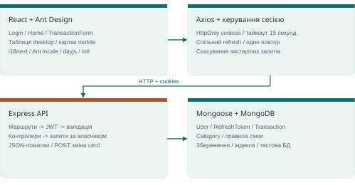
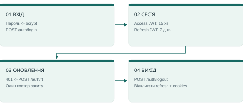

# Daily Ledger - Підсумковий звіт і підготовка до інтерв’ю

Технічне завдання · реалізація, архітектура, рішення та фінальне рев’ю

> Працюючий щоденник доходів і витрат із поясненням рішень та перевіреними межами готовності.

**2026-10-08 · Code snapshot: 72817a2**

## 1. Що отримано в результаті

Завершений функціональний MVP із подальшими покращеннями інтерфейсу та локалізації.

Daily Ledger дозволяє користувачу створювати, переглядати, змінювати й видаляти власні доходи та витрати. Збережено запропонований стек React / Node.js / Ant Design. Для API й даних використано Express, MongoDB та Mongoose. Заглушку сторінки транзакцій і mock-авторизацію замінено робочими сценаріями.

| Напрям | Реалізований результат |
| --- | --- |
| Основна функція | Повний CRUD: сума, категорія, календарна дата, необов’язковий опис. |
| Інтерфейс | Таблиця на desktop, картки на mobile, спільна форма, стани завантаження/помилок, пошук, сортування й підсумки. |
| Дані та доступ | Цілі центи, перевірка дат, власник із сесії, bcrypt/JWT, повторне використання власних категорій. |
| Перевірки | 69 API-тестів + 7 тестів сесії; lint, форматування та production build проходять. |
| Мови | English / Italiano у застосунку; український і англійський звіти для ознайомлення та співбесіди. |

> **Межа готовності**
>
> Це локальна реалізація технічного завдання. Docker Engine на цій машині не запускається. Production deployment, відновлення пароля, публікація GitHub, завантаження Loom і подання форми не завершені.

Звіт зіставляє PDF завдання, початковий commit 44dae2e, поточний код і результати перевірок 08.10.2026. Реалізація та рев’ю виконувались із допомогою AI. На співбесіді варто точно описати свою роль, допомогу інструментів і рішення, які можеш пояснити та продемонструвати.

Як читати: розділи 2-8 пояснюють продукт; 9-12 містять виправлення, докази й обмеження; 13-15 допомагають підготувати відповіді та демонстрацію.

## 2. Вимоги та початковий стан

Відокремлюємо вимоги PDF від пізніших побажань і власних реалізаційних рішень.

| Вимога завдання | Що зроблено |
| --- | --- |
| React, Node.js, Ant Design | Стек збережено: React 18.3.1, Ant Design 5.18.2, Express 4.22.3, Vite 8.3.3. |
| Повний CRUD транзакцій | POST/GET/PATCH/DELETE API та спільна форма створення/редагування. |
| Сума, категорія, дата, опис | Поля валідовані; опис необов’язковий; валюта MVP - USD. |
| Список або таблиця | Desktop-таблиця; нижче 768 px - функціонально рівнозначні картки. |
| Адаптивний інтерфейс | Адаптивна форма, картки й компактні контролі користувача/мови. |
| Щонайменше один API-тест | 69 тестів у Api/specs із реальною ізольованою MongoDB. |
| Фільтрація або сортування - бонус | Додано обидва, а також підсумки доходів, витрат і балансу. |
| GitHub, Loom на 3-5 хв, форма | Локальні коміти, чистий export і сценарій підготовлено. Зовнішня передача ще попереду. |

### Що вже було в шаблоні

Поділ Api/FrontEnd, React/Ant Design/Express, Mongoose-утиліти, маршрутизація, Axios/AuthContext, i18next із common/core перекладами EN/IT та заготовки Jest. Home показував лише текст завдання. Моделі, API й форми транзакцій не існувало.

Вхід і JWT мали mock-поведінку. Форма Forgot password була, але повноцінний сервіс відновлення пароля не працював. Поточний щоденник створено з базових Ant Design компонентів; старі sidebar/table/admin/company модулі не входять до активного застосунку та чистого export.

MongoDB, посилення авторизації, власні категорії, локалізація, підсумки й USD - вибір реалізації або подальші побажання користувача. Початковий i18next був підключений; його повторно інтегровано в перебудований інтерфейс.

Джерело: Technical_Assessment_Somnia(Web).pdf, стор. 1-4, і baseline 44dae2e. PDF описує короткий timebox і подання за 2 години, якщо інше не погоджено. Облік часу цього не підтверджує; подальші UX-запити розширили обсяг. Не слід заявляти про доведене виконання за дві години.

## 3. Архітектура застосунку

Кожен рівень має окрему відповідальність і зрозумілу межу.



| Рівень | За що відповідає і навіщо |
| --- | --- |
| React | Екрани, фільтри, пагінація, модальні вікна. Одна форма для create/edit зменшує розбіжності правил. |
| Axios / session | Запити з cookies, refresh/logout, один повтор і передача помилок. Логіка сесії тестується окремо від React. |
| Express | Явні routes, JWT middleware, валідація, controllers і єдиний формат помилок. Підключаються лише перевірені маршрути. |
| Mongoose / MongoDB | Інваріанти схем, запити за власником, індекси й збереження даних. Інтеграційні тести також використовують реальну БД. |

Створення запису: валідація форми -> перетворення суми на центи -> POST /transactions -> перевірка JWT і користувача -> перевірка полів та бізнес-правил -> реєстрація категорії -> запис транзакції -> відповідь -> оновлення UI. Якщо запит неуспішний, форма показує помилку й зберігає введене.

app.js експортує Express для тестів без відкриття постійного порту. index.js керує запуском і спочатку очікує БД. API слухає 4000, frontend - 3000. MongoDB працює на localhost:27017 через Docker або документований локальний fallback.

Основні файли: FrontEnd/src/routes/Home.jsx; components/TransactionForm.jsx; helpers/core/session.mjs; Api/app.js; controllers/transactions.js; db/connect.js.

## 4. Модель даних та інваріанти

Гроші, календарний день і системний час мають різні призначення.

| Поле Transaction | Представлення й обмеження |
| --- | --- |
| user | Обов’язковий User ObjectId із перевіреної сесії; не повертається в JSON транзакції. |
| type | Тільки income або expense. |
| amountCents | Додатне безпечне ціле: 1-999 999 999; максимум USD 9 999 999,99. |
| category | Стандартна або нормалізована власна назва; до 64 символів. |
| date | Справжня григоріанська дата YYYY-MM-DD, роки 1900-9999. |
| description | Необов’язковий текст до 500 символів; зайві крайні пробіли прибираються. |
| createdAt / updatedAt | Системні timestamps Mongoose; не замінюють вибрану дату операції. |

### Кейс: точна сума

12,34 нормалізується до 12.34. Рядок ділиться на цілу й дробову частини та перетворюється на 1234 центи. API і схема відхиляють дробові центи, нуль, від’ємні й завеликі значення. 12.345 дає помилку, а не мовчазне округлення. Букви не приймаються при наборі та вставці.

### Кейс: дата не змінюється через часовий пояс

2024-02-29 залишається тим самим календарним днем, бо не зберігається як UTC-північ. Перевірка високосного року відхиляє 2023-02-29; також відхиляється 2026-04-31. Майбутні дати зараз дозволені: модель запланованих і фактичних операцій відсутня.

Сортування порівнює date, потім createdAt, потім _id. Записи одного дня мають стабільний порядок; редагування опису не робить старий запис найновішим. Tooltip показує тільки локальний час створення HH:mm:ss. Це не доказ фактичного часу фінансової події.

Інші колекції: User, RefreshToken, Category. Індекси: Transaction(user,date,createdAt); унікальний Category(user,type,name); TTL для refresh expiry. Завершальний _id для сортування не входить до compound-індексу транзакцій.

## 5. Авторизація та життєвий цикл сесії

Сервер перевіряє особу, а cookies передають сесію.



- Пароль зберігається як bcrypt hash із cost 10. Login звіряє hash і дає загальне повідомлення про неправильні дані. Поза тестами діє обмеження 20 спроб входу на хвилину на IP-адресу.
- Access JWT живе 15 хвилин; refresh JWT - 7 днів. Потрібні різні secrets; перевіряються HS256, призначення токена, subject та існування користувача.
- Cookies мають HttpOnly і SameSite=Lax; у production вмикається Secure. Axios надсилає credentials. Локально слід послідовно використовувати 127.0.0.1 у браузері, API та CORS.
- У БД лежить SHA-256 hash refresh-токена, власник і строк дії. Refresh-запит явно перевіряє expiry; коректність не залежить від миттєвого спрацювання TTL.
- Паралельні 401 використовують один поточний refresh. Початковий запит повторюється максимум один раз. Помилка бізнес-запиту після успішного refresh не завершує сесію.
- Logout очікує поточний refresh, відкликає його запис і прибирає cookies. Версія сесії не дозволяє застарілому callback повернути UI у стан входу.

> **Чого ця схема не гарантує**
>
> Скопійований access JWT може діяти до завершення 15 хвилин. Refresh не ротується. Немає синхронізації сесії між вкладками, реєстрації, email verification, відновлення пароля, MFA чи екрана керування сесіями.

POST для refresh/logout відповідає семантиці зміни стану [E1]. SameSite та CORS корисні, але не є твердженням про повний CSRF/XSS-аудит. HTTPS, довірені origins і безпечні production-налаштування потребують окремої роботи.

## 6. Контракт API та права доступу

Власник із перевіреної сесії входить у кожен запит до транзакції.

| Метод і маршрут | Результат |
| --- | --- |
| POST /auth/login | Перевірка credentials; публічний профіль і cookies. |
| GET /auth/check | Поточний профіль або 401. |
| POST /auth/rt | Перевірка refresh-сесії та новий access cookie. |
| POST /auth/logout | Відкликання refresh і очищення cookies. |
| GET /transactions | Записи користувача, впорядковані за датою / створенням / ID. |
| POST /transactions | Створення власного запису; 201 і збережені поля. |
| GET /transactions/:id | Одна власна транзакція. |
| PATCH /transactions/:id | Перевірка переданих полів і повернення оновленого запису. |
| DELETE /transactions/:id | Видалення власного запису; підтвердження 200. |
| GET /categories | Стандартні та власні категорії, згруповані за типом. |

Request body має явний список дозволених полів. user, невідомі атрибути, MongoDB-оператори, неправильні типи та порожній PATCH відхиляються. Read/update/delete шукають одночасно за ID і req.user.id. Для чужого й відсутнього запису результат однаковий - 404.

| Статус | Значення |
| --- | --- |
| 400 / 401 / 404 | Некоректний запит / немає валідної сесії / ресурс відсутній або чужий. |
| 409 | Тип або категорія змінилися між читанням і атомарним оновленням. |
| 413 / 429 / 500 | JSON більший за 16 KB / забагато спроб входу / загальна серверна помилка. |

```
Приклад POST /transactions
{"type":"expense","amountCents":1234,"category":"Food & drinks",
 "date":"2026-10-08","description":"Lunch"}
```

Помилка: {"error":400,"message":"...","data":{"field":"..."}}. field необов’язковий, а error іноді є окремим кодом застосунку. Некоректний JSON отримує фіксоване повідомлення без віддзеркалення фрагментів body. Публічний JSON визначає Api/models/transaction.js.

## 7. Категорії: правила й приклади

Категорія та тип доходу/витрати перевіряються як одна бізнес-умова.

| Ситуація | Поведінка | Чому працює |
| --- | --- | --- |
| Transport / expense -> income | Вибір очищується, з’являється пояснення. | UI перевіряє новий catalog; API незалежно перевіряє пару. |
| Other без додаткової назви | Зберігається стандартне Other. | Поле необов’язкове; зайва власна категорія не створюється. |
| Other + '  pEt   CARE ' | Зберігається Pet Care для повторного вибору. | На сервері: NFKC, trim, стискання пробілів і Title Case. |
| Повторний Pet Care | Одна категорія для цього user/type. | Унікальний індекс і обробка duplicate key захищають upsert. |
| Видалено останній Pet Care запис | Категорія лишається в Your categories. | Catalog зберігається окремо від транзакцій. |
| Змінено тип із чернеткою назви | Чернетка очищується. | Вона не реєструється випадково для іншого типу. |
| Італійське 'tras' | Підказка Trasporti використовує Transport. | Перекладена label зіставляється зі стабільним API-значенням. |

Other відкриває необов’язковий autocomplete поруч із Category на desktop та нижче на mobile. Є окремі Suggested categories і Your categories. Пошук враховує канонічну й перекладену назви; вибір підказки повторно використовує категорію. Clear видно лише за наявності значення; він також очищує пов’язану чернетку.

API повертає catalog лише поточного користувача. Старі власні назви знаходяться в існуючих транзакціях без обов’язкової міграції. Редагування старої несумісної стандартної категорії вимагає виправити вибір.

> **Свідомий компроміс моделі**
>
> Транзакція зберігає назву, а не посилання на Category ID. Каскадне перейменування відсутнє. Реєстрація категорії й транзакція - дві операції: у разі помилки запису може залишитися невикористана категорія. Це не multi-document transaction.

Дивись Api/helpers/categories.js, models/category.js, controllers/transactions.js і FrontEnd/src/components/TransactionForm.jsx.

## 8. UX, адаптивність і мови

Кожна зміна має зрозумілу користувацьку причину.

| Частина | Реалізація та призначення |
| --- | --- |
| Спільна форма | Create/edit мають однакові поля й правила. Під час отримання категорій показуються skeletons. |
| Expense / Income | Іконки напрямку й коричневий/бірюзовий кольори, включно з hover/focus, пояснюють тип. |
| Збереження | Контролі блокуються; ref одразу відсікає повторне натискання. При помилці введене лишається у формі. |
| Desktop / mobile | Таблиця на широкому екрані; нижче 768 px картки: тип і сума, потім категорія/дата, повний опис. |
| Дії | Edit/Delete під вертикальними трьома крапками. Перед видаленням є підтвердження. |
| Пошук і порядок | Фільтр за типом, пошук категорії/опису, сортування дати/суми, по 8 записів на сторінку. |
| Підсумки | Доходи, витрати й баланс рахують усі завантажені записи, незалежно від фільтра. |
| Локалізація | English/Italiano на вході та в щоденнику; вибір локальний для браузера; по 135 ключів diary. |

Архітектуру i18next із шаблону повернуто в активний UI. common/core залишені; diary містить тексти нових екранів. Мова керує HTML lang, Ant Design, dayjs та Intl. Перекладаються стандартні labels, а значення API, власні категорії й описи зберігаються.

Кнопка-іконка Explore the demo заповнює email/password і очищує помилки, але не виконує автоматичний вхід. Форму відновлення пароля не повернуто як удавано робочий сценарій без відповідного сервісу.

Ручні перевірки включають 320/390 px, desktop-форму, focus/tap дати, autocomplete, semantic focus, збереження мови, empty/error/retry. Labels, клавіатурний фокус і Ant Design покращують доступність; повний WCAG або screen-reader аудит не проводився. Українська - мова цього звіту, не додана мова застосунку.

## 9. Що виправлено під час фінального рев’ю

Конкретні послідовності подій, які раніше могли дати неправильний результат.

| Проблема | Виправлення | Причина та межа |
| --- | --- | --- |
| Refresh успішний; бізнес-запит дає 500; UI виходить із сесії. | Повторний запит винесено за межі catch для refresh. | Для запитів активної сесії вихід спричиняє refresh 401; тимчасова помилка дозволяє повтор. |
| Refresh завершується після logout і повертає стан/cookies. | Версія сесії змінюється одразу; logout очікує refresh. | Старі callbacks ігноруються; cookies очищуються останніми. Між вкладками синхронізації немає. |
| Старий auth/check перекриває новий login. | Перевірка версії перед застосуванням результату. | При dispose також видаляються interceptors. |
| Стара відповідь GET перекриває новий edit/delete. | AbortController і перевірка поточного запиту. | Після успішної зміни попереднє завантаження вже не оновить state. |
| Швидке подвійне натискання дає два запити. | Синхронний ref-guard і disabled controls. | Це захист сторінки, а не серверна ідемпотентність. |
| PATCH опису повертає старі type/category. | Атомарний predicate містить початкову пару; конфлікт дає 409. | Захищає бізнес-правило під час серверної гонки, не всі stale forms. |
| GET refresh/logout змінює авторизацію. | Перехід на POST; GET дає 404 без побічних ефектів. | Навігація або prefetch не повинні виконувати ці зміни [E1]. |
| Помилка JSON повертає фрагмент body. | Фіксоване коротке повідомлення. | Відповідь не віддзеркалює потенційно приватний введений текст. |

Прибрано непрацюючі npm scripts default-theme і stylelint, що посилалися на відсутні файли/залежності. Невеликий session.mjs відокремлює координацію сесії від React і тестується справжніми Axios interceptors через Node test runner.

Умовне оновлення спирається на атомарне застосування MongoDB filter/update [E2]. Ігнорування застарілих асинхронних результатів відповідає підходу cleanup React effects [E3]. Великих міграцій або нових продуктових модулів під час фіналізації не додавали.

## 10. Перевірки та сценарії

Результати стосуються конкретно описаної області коду.

| Перевірка | Підтверджений результат |
| --- | --- |
| API integration | 69 тестів / 3 suites: Jest, Supertest і реальна ізольована MongoDB. |
| Frontend session | 7 тестів: Axios interceptors із контрольованим adapter. |
| Покриття API | 94,84% statements; 89,28% branches; 100% functions; 95,41% lines. |
| Статика / збірка | Lint і форматування активного API/frontend проходять; production build успішний. |
| Аудит залежностей | Frontend 0; API runtime 0; повне API-дерево 19 moderate, 0 high/critical. |
| Docker / чистий export | Compose коректний, Engine недоступний. Чистий export: встановлення, build, 76 тестів та ізольований запуск API успішні. |

Api/jest.config.js обмежує coverage активними controllers, middleware, helpers і category route. Моделі, startup, неактивні модулі та UI не входять у ці відсотки. Це не покриття всього репозиторію чи браузерні E2E-тести.

| Кейс | Очікуваний результат і доказ |
| --- | --- |
| Невірний пароль / немає токена | 401; перевіряються bcrypt, підпис, expiry та існування користувача. |
| ID чужого запису | Read/edit/delete дають 404; дані власника не змінюються. |
| 12.345 / від’ємна сума / дробові центи | Помилка форми або 400; неправильного успішного запису немає. |
| Високосний або неможливий день | 2024-02-29 приймається; неможливі дати відхиляються. |
| Несумісна категорія і тип | 400; потрібна коректна пара. |
| Одночасна зміна класифікації | 409; тест втручається реальною MongoDB-зміною після читання controller. |
| Записи одного дня | Date -> createdAt -> ID; редагування не змінює час створення. |
| Два 401 / refresh, потім 500 | Один shared refresh; бізнес-помилка не спричиняє logout. |
| Refresh одночасно з logout | Logout завершується після refresh; старий UI входу не повертається. |

Повний browser flow перевірений вручну; гонка списку перевірена рев’ю коду без browser timing automation. Audit - знімок advisories, не сертифікат безпеки. Build усе ще попереджає про bundle близько 408 KB gzip.

## 11. Запуск, очищення та передача

Команди відтворення й безпечний шлях підготовки фінального коду.

```
У корені репозиторію:
npm run setup
npm run db
npm run seed

Термінал 1: npm run api
Термінал 2: npm run web
http://127.0.0.1:3000
Demo: test@meblabs.com / testtest
```

Потрібен Node 20.19+ у гілці 20.x або 22.12+; локально перевірено 22.23.2. Setup встановлює lockfile-залежності з вимкненими lifecycle scripts, створює відсутні env із двома різними випадковими JWT secrets і не переписує наявні. Node seed додає demo user лише за відсутності.

Compose задає MongoDB 8.0, localhost-порт, healthcheck і постійний volume. Docker Desktop досі не запускається. npm run db:local використовує реальну MongoDB 8.2.6 і .local/mongodb-data для збереження. Це інша база, ніж Docker volume; дані самі не мігрують. Одночасно на 27017 запускається один варіант.

### Небажаний код запуску в шаблоні

Статичний аналіз виявив обфускований loader, імпортований під час старту. Його точну копію збережено як локальний невиконуваний доказ; із робочого застосунку файл і шлях запуску прибрано. Тепер startup підключає лише перевірені routes. SHA-256 повторно звірено; payload при аналізі не запускався.

SHA-256: 35be764c39fa9e27b2d0300c94b1565a68746f8b85f48a1bd1b538ca1d45056a

Це не визначає автора loader, не є повною forensic-перевіркою машини й не доводить відсутність компрометації. Старий Git досі містить loader та env. npm run export:clean копіює тільки явний перелік вихідних файлів, без старої історії, доказів, secrets, залежностей, БД і неактивних модулів.

> **Зовнішня передача окремо**
>
> Для публікації потрібен свіжий source-only export і нова Git-історія; потім запис/перегляд Loom та подання посилань. Повідомлення рекрутеру, публікація й форма в цьому процесі не надсилалися.

## 12. Компроміси та незавершені напрями

Межі MVP допомагають правильно відповідати про подальший розвиток.

| Поточна межа | Пояснення / наступний крок |
| --- | --- |
| Завантажуються всі записи | Простий state MVP. Для масштабу потрібні серверні фільтри, cursor pagination і aggregates. |
| Майбутні дати дозволені | Немає planned/completed. Спочатку визначити бізнес-правило, потім блокувати майбутнє або моделювати плани. |
| Tooltip показує час створення | Це метадані запису. Для фактичного часу потрібні явні occurredAt і timezone. |
| Категорія - назва в записі | Проста схема. Для перейменування/архівування потрібні Category ID та правила зміни історії. |
| Частковий захист конфліктів | Захищена серверна перевірка type/category. Для stale browser forms потрібні version або ETag. |
| Авторизація рівня MVP | Далі: refresh rotation, політика відкликання, email recovery, verification і за потреби MFA. |
| Немає production operations | Потрібні TLS, secret management, доступ до БД, backup, monitoring і deployment. |
| Подальша якість | Browser E2E, accessibility-аудит, великі набори даних, load tests, bundle splitting і оновлення test toolchain. |

Немає робочої реєстрації, reset password, uploads, company/admin функцій, кількох валют або конвертації. Наявність старих файлів у шаблоні не означає, що ці можливості входять у застосунок.

На момент перевірки runtime audit чистий. Залишкові 19 moderate advisories належать development/test-ланцюжку. Автоматичний downgrade Jest не застосовувався, оскільки змінював би перевірений стек тестування; потрібне окреме сумісне виправлення.

MongoDB обрано через шаблон, Mongoose та узгоджений MVP. Це не твердження, що MongoDB завжди краща для фінансових систем. Реляційна модель також доречна; benchmark і перевірка великого навантаження не проводилися.

Не плутати часову лінію комітів із трудовитратами. Обсяг містить подальші UX-запити; підтвердженої заяви про виконання за дві години немає.

## 13. Відповіді на інтерв’ю: дизайн і дані

Спочатку коротка причина, потім конкретний файл або демонстрація.

### 1. Що було взято з шаблону?

Структуру проєкту, стек, Ant Design і концепції routing/auth/i18next. Home був заглушкою. Щоденник і бізнес-логіку реалізовано заново; старі непотрібні модулі залишено неактивними та виключено з export.

### 2. Чому сума в центах?

API приймає ціле число в заданих межах. Клієнт розбирає десятковий рядок за цифрами, не зберігає дробові binary floats. Покажи 12.34 -> 1234 і відхилення 12.345. Підсумки додають центи, форматування відбувається при показі.

### 3. Чому дата є рядком?

Це вибраний календарний день, а не момент у глобальному часі. YYYY-MM-DD не зсувається при зміні timezone. API перевіряє існування дня, а createdAt/updatedAt окремо фіксують створення та зміну запису.

### 4. Як захищено чужі дані?

Owner береться із сесії. У запиті до БД одночасно перевіряються ID та user. Власника не можна передати через body. Тести звертаються до чужого ID й підтверджують 404 та незмінність даних.

### 5. Навіщо валідація в кількох місцях?

UI дає швидкий зворотний зв’язок; API перевіряє недовірений запит і бізнес-правила; schema захищає запис у БД. Обхід форми не дозволяє зберегти неправильні центи або дату.

### 6. Навіщо очищати категорію при зміні типу?

Це залежне поле. Transport належить витратам, тому Income робить його недійсним. Очищення з поясненням запобігає випадковій помилці, а сервер ще раз перевіряє пару незалежно від UI.

### 7. Навіщо окрема колекція категорій?

Користувач може повторно обрати категорію після видалення всіх її транзакцій. Унікальний user/type/name захищає від дублювання. Старі власні назви також беруться із записів; каскадного rename немає.

### 8. Чому UI змінюється після відповіді API?

Для невеликого MVP це зменшує складність rollback. Невдалий save залишає дані у формі, невдалий delete - запис у списку. Старі GET-запити після успішної зміни скасовуються, щоб не повернути застарілий state.

## 14. Відповіді на інтерв’ю: надійність

Пояснюй послідовність подій, а не тільки назву технології.

### 9. Що відбувається після завершення access token?

401 запускає один спільний POST refresh; початкові запити повторюються по одному разу. Refresh 401 завершує сесію. Refresh успішний, але транзакція дає 500 - це помилка операції, не причина logout. Сім frontend-тестів перевіряють ці відмінності.

### 10. Чому refresh/logout переведено на POST?

Вони змінюють стан авторизації. GET має залишатися операцією читання, враховуючи навігацію та prefetch [E1]. Регресійний тест доводить, що старі GET endpoints дають 404 без зміни cookies чи persisted session.

### 11. Яку гонку даних знайшло фінальне рев’ю?

PATCH опису прочитав expense/Transport, а інший запит уже змінив запис на income/Salary. Старий код міг повернути попередню класифікацію. Тепер атомарний filter містить початкові type/category і повертає 409, якщо вони змінилися.

### 12. Це повний optimistic concurrency control?

Ні. Захищено класифікацію між серверним читанням і записом. API не приймає revision/ETag із браузера. Для загальних stale edits суми чи опису діє last-writer-wins; це явно зазначений наступний крок.

### 13. Що відкликає logout?

Refresh-сесію в БД і cookies браузера. Скопійований access JWT живе до expiry. Негайне відкликання access і refresh rotation потребують додаткової session/version або token-family моделі.

### 14. Як масштабувати застосунок?

Перенести фільтри й сортування до обмежених API-запитів; додати cursor pagination зі стабільною трійкою date/createdAt/ID та aggregates. Спочатку виміряти реальні запити й індекси, потім вирішувати про кеші.

### 15. Які тести справді інтеграційні?

69 API-тестів використовують реальний ізольований mongod і HTTP через Supertest. 7 frontend-тестів працюють зі справжніми Axios interceptors та контрольованими відповідями. Browser E2E серед них немає; coverage має обмежену область.

### 16. Що чесно назвати незавершеним?

Docker Engine не працює локально; recovery/registration/MFA і production deployment відсутні; майбутні дати дозволені; tooltip означає час створення. Точне пояснення меж і демонстрація CRUD сильніші за непідтверджену заяву про production readiness.

## 15. Демонстрація, карта коду та походження

Практичний сценарій на 3-5 хвилин і навігація для поглиблених запитань.

| Час | Що показати |
| --- | --- |
| 0:00-0:30 | Коротко про шаблон і MongoDB. Demo autofill, вхід та контрол мови. |
| 0:30-1:30 | Створити вигадану витрату USD12.34 і дохід. Показати таблицю/картки, totals і пошук. |
| 1:30-2:20 | Редагувати той самий запис, показати неправильну точність і очищення категорії; видаляти лише тестові дані. |
| 2:20-2:50 | Reload і збереження даних; mobile cards, меню дій, date sorting та tooltip часу. |
| 2:50-3:40 | Запустити тести; пояснити owner, центи, календарну дату й одну виправлену гонку. |
| 3:40-4:30 | Назвати межі, відмінність Docker/fallback і наступні кроки. Завершити робочим екраном. |

| Тема | Файли репозиторію |
| --- | --- |
| Запити, owner, помилки | Api/routes/transactions.js; middlewares/isAuth.js; middlewares/validateTransaction.js; controllers/transactions.js |
| Дані, категорії, токени | Api/models/; helpers/categories.js; helpers/auth.js; controllers/auth.js |
| Інтерфейс і сесія | FrontEnd/src/routes/Home.jsx; components/TransactionForm.jsx; helpers/core/session.mjs |
| Тести й повторний запуск | Api/specs/; FrontEnd/specs/auth-session.test.mjs; package-lock.json; scripts/setup-env.cjs |
| Передача і документація | README.md; docs/VERIFICATION.md; docs/SECURITY.md; docs/LOOM.md; scripts/export-clean.cjs |

Локальні етапи: 024f54f - secure CRUD MVP; 04efd25 - категорії/форми; 4630257 - mobile/actions/sorting; 84d250d - локалізація; 72817a2 - фінальне рев’ю. Гілки накопичують попередні зміни, а не є незалежними паралельними feature PR. Це не журнал трудовитрат.

Вимоги: Technical_Assessment_Somnia(Web).pdf. Пояснення принципів: [E1] https://developer.mozilla.org/en-US/docs/Glossary/Safe/HTTP; [E2] https://mongoosejs.com/docs/8.x/docs/tutorials/findoneandupdate.html; [E3] https://react.dev/reference/react/useEffect. Реалізовану поведінку підтверджують локальний код і тести.

> **Стисла відповідь на 30 секунд**
>
> Це щоденник доходів і витрат із доступом тільки до власних записів. Можу показати CRUD, пояснити центи та календарні дати, продемонструвати тести owner isolation і розповісти, як фінальне рев’ю виправило stale requests та одночасну зміну класифікації. Межі MVP і production-робота описані окремо.
